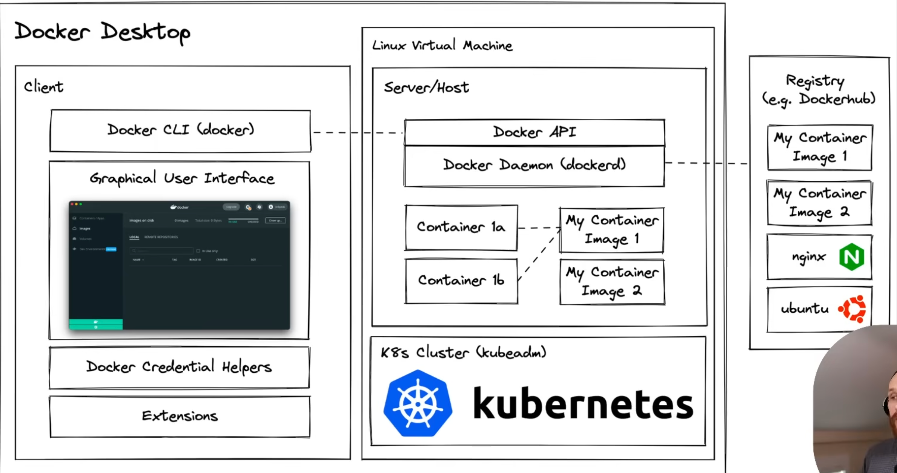
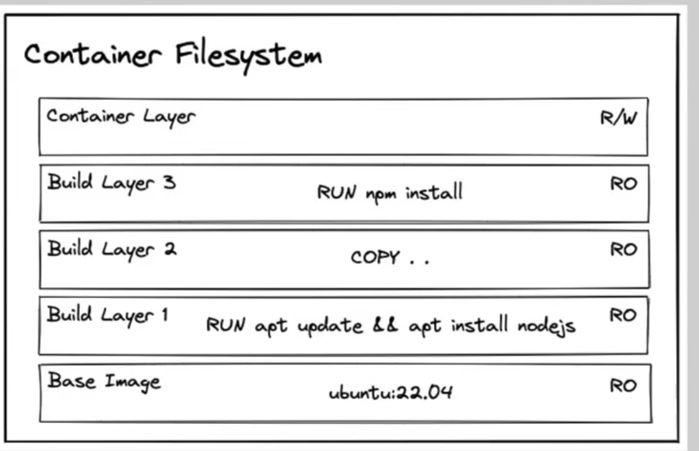

# Docker

Taking notes from:
* https://www.youtube.com/watch?v=RqTEHSBrYFw
* https://github.com/sidpalas/devops-directive-docker-course

## 1 History & Motivation
* A docker container is a lightweight, stand alone, executable, package of software that
includes everything needed to run an application.
* Bare metal < Virtual machines < Docker containers
* Docker container is an instance of a docker image.
* Docker container contains application and binaries and libraries.
* Reduces dependency hell + is isolated.

## 2 Technology Overview
* namespaces, control groups & union filesystem.
* namespace => isolate context to container
* cgroup => control how resources shared for a given container. Avoids an application taking
up too much resources.
* Union mount filesystem => Allows you take seperate filesytems to be combined together.
* Docker desktop does most of the work for us.


## 3 Installation & Setup
https://docs.docker.com/
* Hello world example for docker:
```bash
docker run rancher/cowsay cowsay "Sup big man"
```

* Setup postgres 15.1 on port 5432 on alpine os. (Note we need to proved password env variable)
```bash
docker run --env POSTGRES_PASSWORD=foobarbaz --publish 5432:5432 postgres:15.1-alpine
```

## 4 Using 3rd Party Containers
https://hub.docker.com/
* Any data created or modified in a container is ephemeral.

* Solution => volume mount, bind mount
* https://github.com/sidpalas/devops-directive-docker-course/blob/main/04-using-3rd-party-containers/README.md

* To interact with container from the command line use `-it` flag.
```bash
docker run --interactive --tty ubuntu:22.04
```
same as 
```bash
docker run -it ubuntu:22.04
```

* To list all running containers do (-a flag to list all, even exited ones):
```
docker ps -a
```

* Docker doesnt remember installing after setting up container. Specify install as part 
of docker image in dockerfile.

got upto: https://youtu.be/RqTEHSBrYFw?si=HKyCoKDiSb6aGvXI&t=3427
