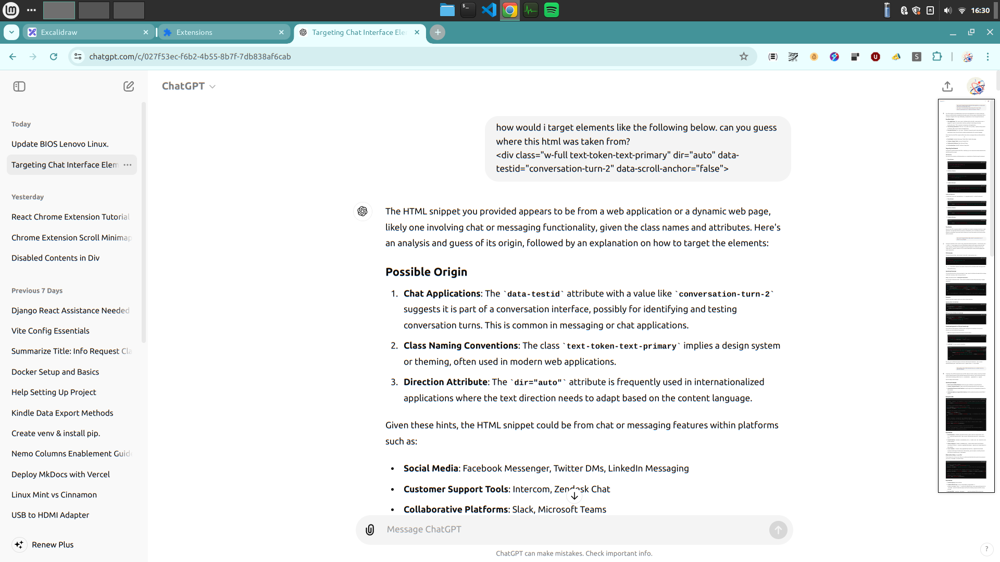

# Scroll Minimap for Chatgpt

**project timeline**: 25th May - 28th May


I made this extension because I kept getting lost during my conversations with chatgpt. Sometimes chatgpt be giving you alot of useless info you didnt ask for. Navigating through what it says and finding the useful bits can be pretty tedious. This extension aims to solve that.

Me trying to find that one prompt on how to commit fraud in chatgpt:


## Usage

1. Download the extension from [insert chrome web store link here]

2. Restart chrome 

3. Go to chatgpt, you should see a toggle button for the minimap in the top right corner. Open the minimap by pressing this button.

4. Ask chatgpt a message and hit refresh minimap. A condensed view of the conversation should be shown in the minimap.


## Issues

Report issues here https://github.com/Aebel-Shajan/scroll-minimap-for-chatgpt/issues

* The scaling of the conversation to the minimap is not always one to one. This can lead to the scrollbar not syncing correctly.


# Working out 

## Existing/similar chrome extensions

* https://github.com/Brian-Gaffney/Chrome-minimap (does not work)

* https://github.com/chintown/monocle (works but not for chatgpt chat)


Useful libraries:

* https://html2canvas.hertzen.com/documentation.html

These other extensions are really cool but I found that they did not work with chatgpt. At first I tried to copy the projects and change them for chatgpt. But there was alot going on and I could not understand the logic. 

Also I looked into using react to make this but that was too complicated and would take ages to get set up. I ended up just having all the logic in one file `content.js` with around 160 lines of code.

## Wireframe


## Why the minimap doesnt work for chatgpt
Setting `sourceScrollContainer=document.body` and `sourceElements=document.body.childNodes` does not work.


Instead use this selector `'[data-testid^="conversation-turn-"]'` to target chatmessages and then call `.parentNode` to get the `sourceElements`.

```javascript
// Functions
function getSourceElements() {
    try {
    // cant directly target due to uniquely identified class names
    // so gotta hack it
    sourceElements = document.querySelector('[data-testid^="conversation-turn-"]').parentNode
    } catch {
        sourceElements = document.body.cloneNode(true)
        if (sourceElements.contains(extensionContainer)) {
            sourceElements.removeChild(extensionContainer)
        }
    }
}
```

We can't target the element for `sourceScrollContainer` which handles user scrolling of elements due to uuid class name.


Easier to use `sourceElements` and call `.parentNode` till we get it.

```javascript
function getSourceScrollContainer() {
    try {
        // Used to retrieve information about scroll position
        sourceScrollContainer = sourceElements.parentNode.parentNode;
    } catch {
        sourceScrollContainer = document.body.cloneNode(true)
        if (sourceElements.contains(extensionContainer)) {
            sourceElements.removeChild(extensionContainer)
        }
    }
}
```





## Scroll bar

**Aim**: Get a blue rectangle overlay to appear over the minimap which shows the current location in the chat.

In styles we set the scalling as 0.1. Therefore the targetElements are 0.1 times the sourceElements.

```css
#minimap > *{
  transform: scale(0.1);
  transform-origin: top left;
  width: 1000%;
  height: 100%
}
```


We want to find y (the top of the scroll bar from the top of the targetElements). 

y = 0.1 * v;

```javascript 
function updateScrollBar() {
    if (sourceScrollContainer) {
        const scrollBarTop = sourceScrollContainer.scrollTop * 0.1;
        scrollBar.style.top = `${scrollBarTop}px`;
    }
}
```

(*issue with this: the text in the chat wraps differently based on how wide the minimap is. If the source elements are narrow, the target elements still remain at a fixed width of 100px.)

## Automatic scrolling of minimap

**Aims**: 
* We want the minimap to automatically scroll as the user scrolls through the chat. i.e. Find the value for minimap.scrollTop. 
* We also want to scroll such that
    * when the user has scrolled to the top the scroll bar is shown in the top of the minimap
    * when the user has scrolled to the middle the scroll bar is shown in the middle of the minimap


From the diagram above we want to find the value for m_top. 

$$ 
m_{top} = x - s_{rel}
$$

We know $x$ but not $s_{rel}$.

 The ratio between of $u$ and $v$ should be the same as the ratio between $s_{rel}$ and $m_{size}$:

$$ 
{ s_{rel} \over m_{size} } = { u \over v}
$$

$$
s_{rel} = {m_{size} \times u \over v}
$$


Substitute value for $s_{rel}$ and remember that $x=0.1 \times u$:

$$
m_{top} = (0.1 \times u)  - {m_{size} \times u \over v}
$$

$$
m_{top} = (0.1  - {m_{size}  \over v} ) \times u
$$

Putting this into code:

```javascript
function updateMinimapScroll() {
    if (sourceScrollContainer) {
        const u = sourceScrollContainer.scrollTop
        const v = sourceScrollContainer.scrollHeight
        const m_size = minimap.offsetHeight 
        let minimapScrollTop = u * (0.1 - (m_size/v))
        minimap.scrollTo(0, minimapScrollTop);
    }
}
```


## Click and drag the scroll bar
I did this but I don't remember how I did it, or why it even works. 

```javascript
function handleScrollBarMove(mousePos) {
    if (sourceScrollContainer) {
        const scale = sourceScrollContainer.scrollHeight / (sourceElements.offsetHeight * 0.1);
        const offset = scrollBar.offsetHeight * 0.5 * 0.1;
        const sourceScrollAmount = (mousePos - minimap.getBoundingClientRect().top + minimap.scrollTop - offset) * scale;
        sourceScrollContainer.scrollTo(0, sourceScrollAmount)
    }
}
```

## Highlight user prompts

**Aim**: Make the user prompts stand out in the minimap

I found out chat messages are the even indexed elements in targetElements. Then I changed the background color to blue.
```javascript
function colorUserChat() {
    userChatElements = targetElements.querySelectorAll('[data-testid^="conversation-turn-"]').forEach((element, index) => {
        // odd indices are user chat messages. omg i am mega brain for figuring this out
        if (index % 2 == 0) {
            element.style.backgroundColor = '#00DFFF';
        }
    })
}
```


# Future additions

* Add text input so users can select their own sourceElements using selectors.

* Make it work on all websites not just chatgpt.
